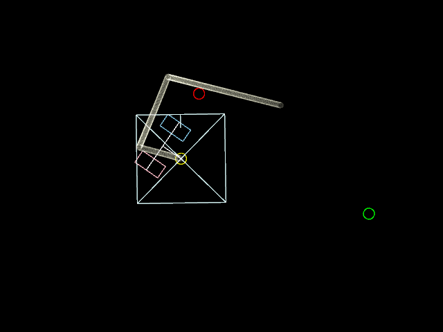

active caster odometry
======================

openFrameworksで書いた双輪キャスタ型駆動機構とやらのシミュレーション。

[日本ロボット学会誌に出てた論文](https://www.jstage.jst.go.jp/article/jrsj1983/18/8/18_8_1166/_pdf)のモデルの動きをみたくて作ってみた。
一応手動操作にも対応している。

使い方
------
- a/z  左の車輪の回転数を変更する
- d/c  右の車輪の回転数を変更する
- s/x  両方の車輪の回転数を変更する
- q/e  車体を回転させる
- スペース  初期化する
- マウスクリック  目標地点を設定する
